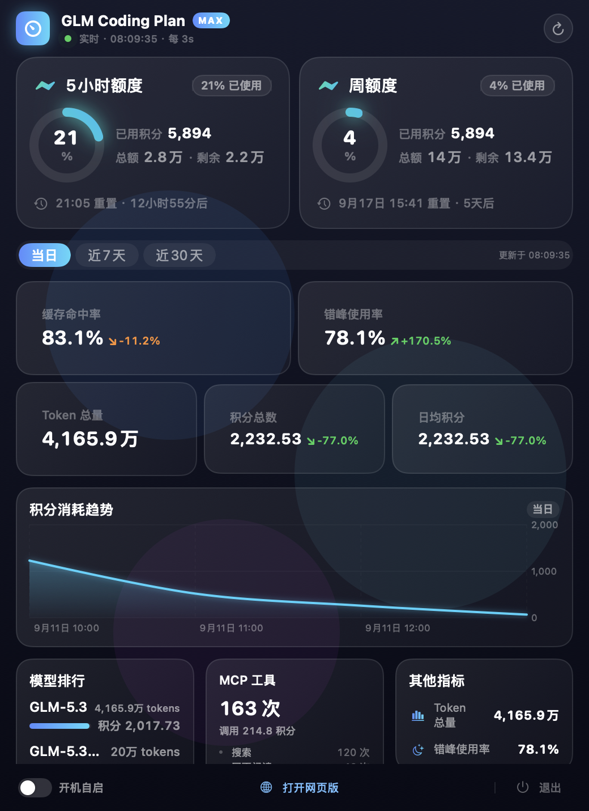

# GLM StatusBar

macOS 菜单栏应用，实时展示 [GLM Coding Plan](https://bigmodel.cn/coding-plan/personal/overview) 的 5 小时额度与周额度使用情况。

## 界面预览



## 功能

- **菜单栏常驻**：`仪表图标 + 7%·1%` 双额度百分比，按使用率着色（绿 <50%、橙 50–80%、红 >80%）
- **左键图标**打开/收起面板；**右键图标**弹出菜单（立即刷新 / 打开网页版 / 退出登录 / 退出应用）；点击面板外任意位置自动收起
- **3 秒自动轮询** + 面板内手动刷新按钮
- **右键菜单**：立即刷新、打开网页版、打开 Codex / ZCode（未安装时跳转官网）、退出登录、退出应用
- **用量看板**：当日 / 近7天 / 近30天切换，缓存命中率、错峰使用率、积分总数、日均积分、Token 总量、积分消耗趋势图、模型用量排行、MCP 工具调用一屏尽览
- **下拉面板**：每张额度卡片显示大号百分比、已用/总积分（对齐网页端「2,140 / 2.8万」格式）、动画进度条、重置时间与倒计时
- **内置登录**：App 内打开 bigmodel.cn 登录页，登录后自动提取凭证（无需手动复制 token）
- **凭证缓存**：token 存于 App 本地缓存（UserDefaults），重启免登录；过期自动弹出重新登录
- **开机自启**：面板底栏开关，基于 SMAppService 注册登录项
- **最新 macOS**：原生 SwiftUI `MenuBarExtra`，兼容 macOS 15 – 26（Tahoe）

## 数据来源

`GET https://bigmodel.cn/api/monitor/usage/quota/limit`，Authorization 头使用登录后 `localStorage["bigmodel_token_production"]` 的值（与网页端一致，原样发送）。App 只读该接口，不做任何写操作。

## 构建与运行

```bash
# 产出可双击运行的 "GLM StatusBar.app"（含 ad-hoc 签名）
./make_app.sh
open "GLM StatusBar.app"

# 开发模式直接运行
swift run

# 单元测试（29 个用例：解码/映射/格式化/错误分类/token 归一化）
./run_tests.sh
```

> 若 Xcode 许可协议尚未同意（`sudo xcodebuild -license accept`），脚本会自动回退到 CommandLineTools 工具链完成构建与测试。
>
> 未做开发者证书分发签名时，首次打开 .app 需右键 →「打开」绕过 Gatekeeper。

## 使用

1. 首次启动点击菜单栏图标 →「登录 BigModel」
2. 在弹出的窗口中完成手机号/微信登录
3. 登录成功后窗口自动关闭，额度立即显示并开始 3 秒轮询

## 项目结构

```
Sources/GLMStatusBar/
├── App/        # 入口、MenuBarExtra、状态机与轮询调度
├── Auth/       # Token 缓存 + WKWebView 登录窗口
├── Service/    # 接口模型、防御性字段映射、格式化/日期解析
└── UI/         # 下拉面板与额度卡片
Tests/GLMStatusBarTests/
└──             # JSON fixture 解码、标题映射、万/千分位格式、
                # 阈值分级、倒计时、401/1001 错误分类、token 归一化
```
